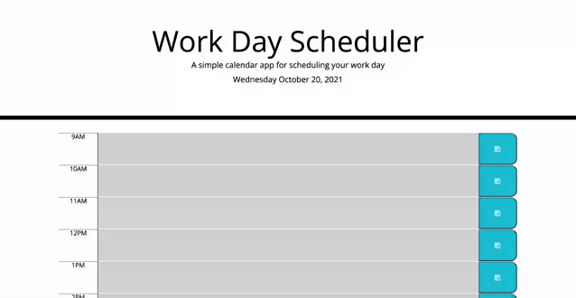

# Day-Planner

## User Story

AS AN employee with a busy schedule
I WANT to add important events to a daily planner
SO THAT I can manage my time effectively

GIVEN I am using a daily planner to create a schedule
WHEN I open the planner
THEN the current day is displayed at the top of the calendar
WHEN I scroll down
THEN I am presented with timeblocks for standard business hours
WHEN I view the timeblocks for that day
THEN each timeblock is color coded to indicate whether it is in the past, present, or future
WHEN I click into a timeblock
THEN I can enter an event
WHEN I click the save button for that timeblock
THEN the text for that event is saved in local storage
WHEN I refresh the page
THEN the saved events persist

Deployed Application: [Password Generator](https://florenciab94.github.io/Day-Planner/)

## Installation

To look at the project, follow GitHub's instructions on how to clone a repository to your computer here:
[Cloning a Repository](https://docs.github.com/en/github/creating-cloning-and-archiving-repositories/cloning-a-repository-from-github/cloning-a-repository "GitHub's guide to cloning a repository")

# Credits

[DCode YouTube Channel](https://www.youtube.com/c/dcode-software)

## License

[MIT](https://choosealicense.com/licenses/mit/)
